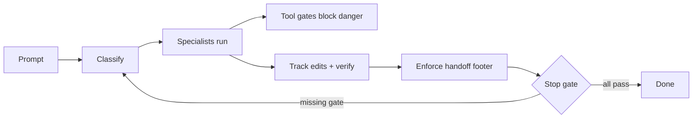

# multi-agent-sdlc-crew

[](https://github.com/C0FFEEC0DE/multi-agent-sdlc-crew/actions/workflows/validate.yml)
[](https://github.com/C0FFEEC0DE/multi-agent-sdlc-crew/actions/workflows/hooks-test.yml)
[](https://github.com/C0FFEEC0DE/multi-agent-sdlc-crew/actions/workflows/python-tests.yml)
[](https://github.com/C0FFEEC0DE/multi-agent-sdlc-crew/actions/workflows/security-scan.yml)

A **hook-gated SDLC profile for Claude Code**: shell hooks enforce a
discover → design → implement → verify → review → docs flow, eight specialist
agents do the work, and a benchmark suite catches agent regressions on every PR.

It gives you: deterministic handoff/stop contracts, token-spend discipline, and
defense-in-depth command blocking — all as a drop-in `~/.claude` profile.

## Install

```bash
./install.sh
```

Backs up your current `~/.claude` config, then installs this one. Restart Claude Code.

## How it works



Full diagram and the pieces: [`docs/architecture.md`](docs/architecture.md).

## Agents

| Alias | Role | Purpose |
|-------|------|---------|
| `@m` | Manager | Orchestrates other agents |
| `@cr` | Code Reviewer | Code review + security |
| `@t` | Tester | Verification + regression |
| `@e` | Explorer | Codebase exploration |
| `@a` | Architect | System design |
| `@bug` | Bugbuster | Bug hunting |
| `@dbg` | Debugger | Debugging issues |
| `@doc` | Docwriter | Documentation |

Full names work too: `@code-reviewer`, `@tester`, etc.

## Usage

```
@e explore the auth module
@cr review api.py
@t write tests for utils
@manager implement new feature: user authentication
```

### Slash commands

- `/manager` — manager-led orchestration
- `/explore` — codebase exploration
- `/bug` — bug hunting
- `/debug` — debugging
- `/test` — testing
- `/design` — design
- `/refactor` — refactoring
- `/review` — code review
- `/docs` — documentation

These are the documented entry points; the hooks enforce the actual handoff and stop gates.

### Required handoffs

| Type | Required |
|------|----------|
| feature | verification or `@t` + `@cr` + (`@e` or `@a`) |
| bugfix | verification or `@t` + `@cr` + (`@bug` / `@e` / `@dbg`) |
| refactor | verification or `@t` + `@cr` + (`@a` or `@e`) |
| review | `@cr` |
| docs | `@doc` |

## Configuration

- **Model:** none pinned — your runtime default applies. Set `"model": "…"` in `claudecfg/settings.json` to fix one.
- **`effortLevel`:** defaults to `medium` (lower spend); raise to `high` for hard design/verify/judge stages.
- **Safety:** `permissions.deny` blocks `sudo`, `mkfs`, `dd`, `rm -rf /`, `rm -rf ~`, force-push, and secret reads. Auto-execution only inside project folders.
- **Observability:** `Notification` and other runtime events log to `~/.claude/logs/*.jsonl` (rotated at 1 MB).
- See [`docs/token-cost.md`](docs/token-cost.md) for the full spend story.

## Docs

- [`claudecfg/GUIDE.md`](claudecfg/GUIDE.md) — cheatsheet
- [`docs/architecture.md`](docs/architecture.md) — how the hooks fit together
- [`docs/token-cost.md`](docs/token-cost.md) — minimal token spend
- [`docs/benchmarking.md`](docs/benchmarking.md) — benchmark setup
- [`docs/agent-contracts.md`](docs/agent-contracts.md) — agent contracts

## Contributing

See [`CONTRIBUTING.md`](CONTRIBUTING.md). Run `make lint`, `make test`, `node scripts/validate.mjs` before a PR. Report security issues via [`SECURITY.md`](SECURITY.md).

## License

MIT — see [`LICENSE`](LICENSE).