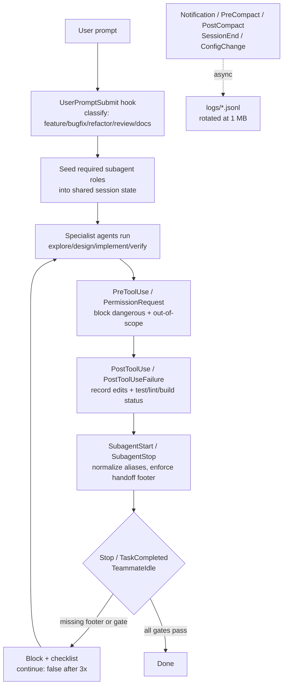

# Architecture

How the hook-gated SDLC profile fits together. One diagram, then the pieces.

## Flow

## The pieces

### 1. Session state (`claudecfg/hooks/lib.sh`)

Every hook reads and writes a per-session JSON state file under
`~/.claude/state/<session_id>.json`. It tracks: task type, required subagent
roles, whether code/docs changed, test/lint/build success, stop-block count,
and the subagent handoffs seen so far. Updates are atomic (mktemp + mv) under a
portable `mkdir` advisory lock with stale-by-age recovery. This is the backbone
every gate reads from.

### 2. Classification (`user-prompt-submit.sh`)

`UserPromptSubmit` classifies the turn as `feature`, `bugfix`, `refactor`,
`review`, `docs`, `support`, or `other`, then seeds the required specialist
roles into state. The required handoffs per type are in
[`agent-contracts.md`](agent-contracts.md).

### 3. Tool gates (`pre-tool-use.sh`, `permission-request.sh`, `permission-denied.sh`)

`PreToolUse` and `PermissionRequest` hard-deny dangerous commands
(`sudo`, `mkfs`, `dd`, `rm -rf /`, `git push --force`, remote shell bootstrap)
and release/deploy automation. `PermissionDenied` retries non-hard-blocked
commands except in benchmark headless mode. Settings `permissions.deny` is a
static belt; the hooks are the suspenders.

**Sandbox:** `settings.json` ships with `sandbox.enabled: false`. The hook
gates above already block dangerous commands, and enabling the sandbox would
interfere with hooks that need to write state/logs under `~/.claude`. If you
prefer belt-and-suspenders, enable the sandbox and grant the hooks' write
paths explicitly; otherwise leave it off and rely on the gates.

### 4. Edit + verification tracking (`post-edit-write.sh`, `post-bash.sh`, `post-tool-failure.sh`)

`PostToolUse` for `Edit|Write` marks `code_changed` / `docs_changed`. For
`Bash`, it classifies the command as test/lint/build and records
`tests_ok`/`lint_ok`/`build_ok` (and the `_failed` counterparts). These flags feed
the stop gate.

### 5. Subagent contract (`subagent-start.sh`, `subagent-stop-guard.sh`)

`SubagentStart` normalizes the agent label to a canonical alias via
`aliases.json` (so `@code-reviewer`, `@explorer`, and `Code Reviewer(...)`
all collapse to `cr` / `e`) and records the handoff. `SubagentStop` requires a
handoff footer with exact line prefixes (`Outcome:`, `Changed files:` /
`No files changed:`, `Verification status:`, and `Remaining risks:` or
`Next step:`). Generic Task tool types are filtered out — they're dispatch
types, not roles.

### 6. Stop gate (`stop-guard.sh`, `task-completed.sh`, `teammate-idle.sh`)

`Stop`, `TaskCompleted`, and `TeammateIdle` share gate logic. After code/config
changes, the final summary must include explicit lines for verification status,
review outcome, changed files, and remaining risks (and docs status when docs
are required). They also enforce the role-specific specialist handoffs. If the
same block recurs three times, the hook emits `continue: false` to stop the
runtime retrying the same summary forever — a token-spend safety valve.

### 7. Observability (`notification.sh`, compact + session-end hooks)

`Notification`, `PreCompact`, `PostCompact`, `SessionEnd`, and `ConfigChange`
run `async:true`, off the critical path, and append JSONL to `~/.claude/logs/`.
Every stream rotates past 1 MB (`lib.sh: rotate_jsonl_if_needed`) so logs never
grow without bound.

## Invariants the contract protects

- **Footer prefixes are fixed.** Prompt templates, hook guards, and golden
  benchmark tasks all assert the same line prefixes. `scripts/validate.sh`
  and `tests/bench/test_task_fixture_alignment.py` keep them from drifting.
- **Role aliases are hidden but functional.** Legacy persona aliases still
  canonicalize to roles via `aliases.json` so historical transcripts keep
  resolving; they are intentionally not surfaced in user-facing docs.
- **No release/deploy.** Automation for publishing is intentionally disabled
  in this profile.