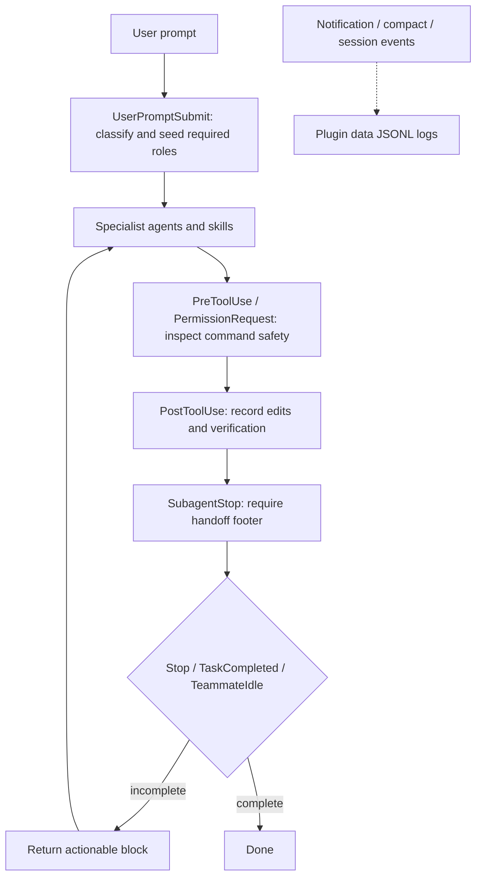

# Plugin architecture

`multi-agent-sdlc-crew` is self-contained inside this plugin directory. Claude
Code loads the manifest, then every hook invokes the shared Node entry point at
`modules/hook-dispatcher.mjs`.

## Flow

## Components

- `hooks/hooks.json` maps Claude Code events to `node` and the dispatcher.
- `modules/hook-dispatcher.mjs` parses the event and routes to the focused
  state, workflow, verification, transcript, policy, and output modules.
- `agents/` contains the eight specialist prompts; `skills/*/SKILL.md`
  contains slash-command workflows.
- `assets/aliases.json` maps accepted role names to canonical aliases.
- `references/` contains all documentation agents need while the plugin is
  installed.

## State and telemetry

Mutable state is written outside the installed plugin tree. Claude Code supplies
`CLAUDE_PLUGIN_DATA`; the runtime falls back to its documented Claude data
directory when that variable is absent. The project-local progress ledger is
`<projectDir>/.claude-crew/progress.md` unless `CLAUDE_CREW_PROGRESS_FILE` is
set. Both locations keep installation files immutable.

Notification and lifecycle logs are JSONL streams under plugin data and rotate
at 1 MiB by default. The runtime makes no network calls.

## Safety boundary

The command policy is defense in depth, not a sandbox. It can deny known
dangerous command strings before execution, but cannot prove the effect of
shell indirection or the surrounding environment. See
[command policy](command-policy.md) and [threat model](threat-model.md).
